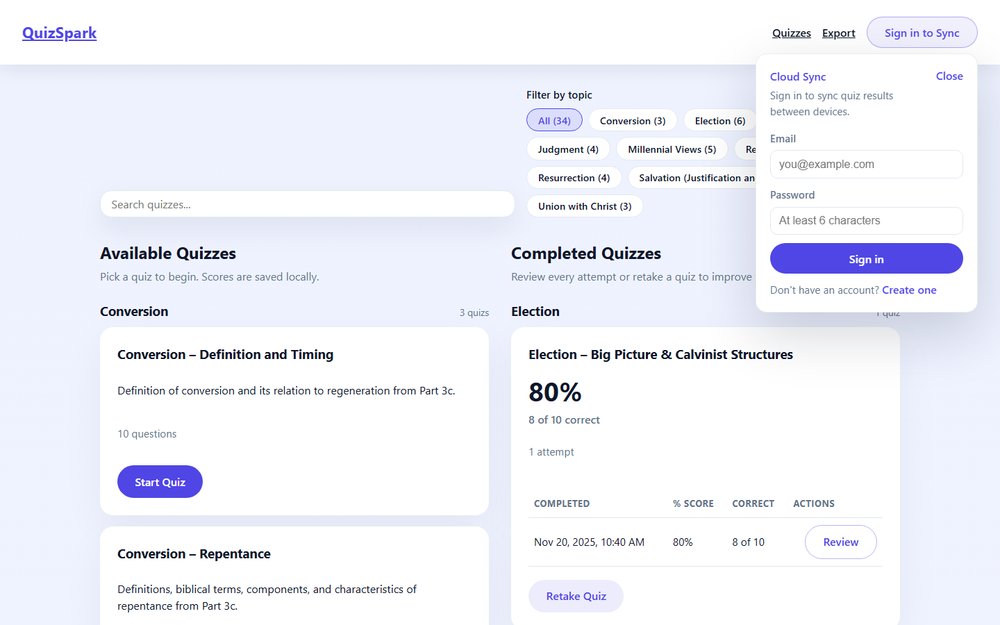
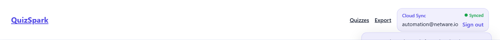
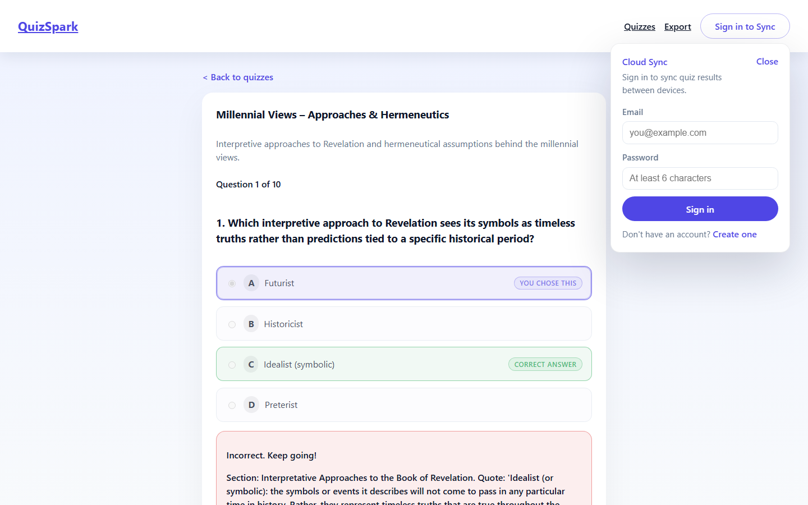
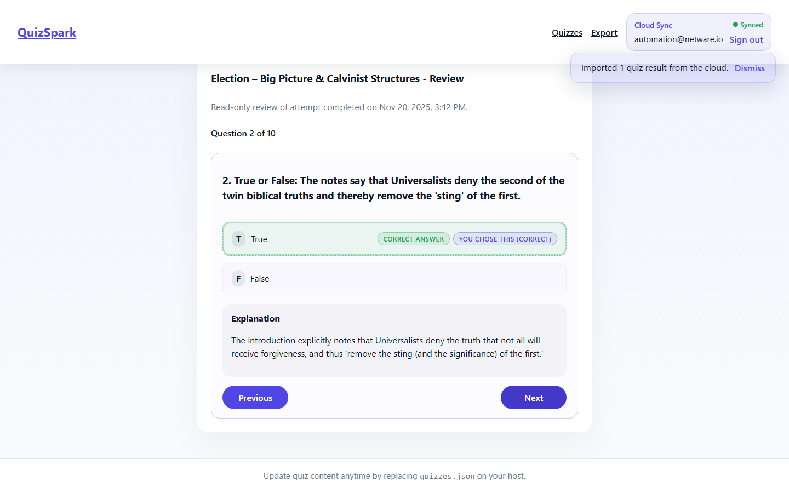

# UI Functional Description

This guide documents the current QuizSpark UI and anchors the narrative with canonical screenshots. Re-generate the images with `npm run capture:screens` whenever significant styling or behavior changes to keep the visuals in sync with the codebase.

## Dashboard

The dashboard mirrors the layout mockups while layering in live capabilities:

- **Global chrome.** The `QuizSpark` brand links home, the header nav jumps to the quiz list or export tools, and the `Sign in to Sync` button toggles the Cloud Sync panel. Logged-out visitors see a dialog with validation and helpful error copy; authenticated users get the inline status pill plus sign-out affordance.
- **Search + filters.** A debounce-free search field filters titles, descriptions, and group labels in both columns. Topic pills show the quiz count per taxonomy bucket, persist via `quizActiveGroupFilter` in `localStorage`, and collapse into a menu on small screens.
- **Available quizzes.** Cards highlight the description, question count, and `Start Quiz` call to action. Empty/search states render contextual `StatusMessage` components so the experience never feels broken.
- **Completed quizzes.** Each card summarizes the latest score, attempt tally, and includes an accessible table for drill-ins. `Review` actions deep-link to `/quiz/:quizId/review/:attemptId`, while `Retake Quiz` routes into a fresh attempt.
- **Export tools.** The footer card contains export buttons for quizzes and attempts along with the import workflow that deduplicates via `attemptId`, matching the JSON transfer docs.

Cloud Sync flips into an authenticated pill once the user signs in. The badge shows the latest status (`Synced`, `Syncing`, `Using local data`, or `Cloud disabled`) while the inline email plus `Sign out` button keeps the action consistent with the unauthenticated trigger.

## Quiz-Taking Flow

- **Sequential questions.** Learners progress linearly with a visible `Question X of Y` indicator and back-link to the dashboard.
- **Answering and feedback.** Radio options adopt selection, correct, and “you chose this” pills to keep state obvious. The `Check answer` button swaps to `Next question`/`Finish quiz` once feedback renders, and inline form errors prevent advancing without a choice.
- **Explanations.** Every question surfaces its rationale so learners understand why an answer was right or wrong before proceeding.

## Review Mode

- **Contextual summary.** The card title, description, and completion timestamp remind learners when the attempt happened.
- **Locked answers.** Correct responses are highlighted in green while the selected answer retains its purple accent and “You chose this (correct)” label.
- **Navigation controls.** Previous/Next buttons step through the same question order, and the final question swaps to `Finish Review` which returns home.
- **Explanations on every step.** The right-hand column keeps the same explanatory copy from the live quiz for quick refreshers.

## Refreshing the Screenshots

1. Ensure dependencies are installed (`npm install`).
2. If this is the first time using Playwright on the machine, also run `npx playwright install chromium` to download the browser once.
3. Run `npm run capture:screens`. The helper script builds the SPA, launches `npm run preview` on an available localhost port, seeds deterministic attempts in `localStorage`, and captures the dashboard, quiz, and review states with Playwright/Chromium.
4. Update this markdown file if you add or remove screenshots so future contributors know what each image represents.
